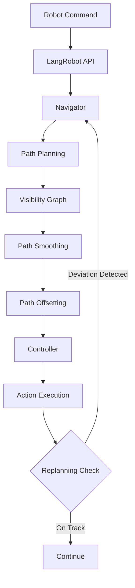

# Navigation Stack and Path Planning

## Overview

The VLMaps navigation stack provides robust path planning and execution for robot navigation in indoor environments. This document explains how the navigation system works, recent improvements made to address common issues, and how to configure and tune the navigation parameters.

## Navigation Architecture

The navigation stack consists of several key components:



### Components

1. **Navigator** (`vlmaps/navigator/navigator.py`): Main navigation coordinator
   - Manages visibility graph construction
   - Handles path planning requests
   - Tracks replanning state

2. **Path Planning** (`vlmaps/utils/navigation_utils.py`):
   - Builds visibility graph from obstacle map
   - Plans shortest path using pyvisgraph
   - Applies path smoothing and offsetting

3. **Controller** (`vlmaps/controller/discrete_nav_controller.py`):
   - Converts path waypoints to discrete actions
   - Generates `move_forward`, `turn_left`, `turn_right` commands

4. **Robot Execution** (`vlmaps/robot/habitat_lang_robot.py`):
   - Executes actions in simulator
   - Monitors progress and triggers replanning

## How Path Planning Works

### 1. Obstacle Map Generation

The system starts with an obstacle map generated from the 3D map:

- **Height filtering**: Voxels between `h_min` (default: 0m) and `h_max` (default: 1.5m) are considered obstacles
- **Obstacle map**: Binary map where `1` = free space, `0` = occupied
- **Cropping**: Map is cropped to the region containing obstacles

### 2. Visibility Graph Construction

The visibility graph is built from obstacle contours:

```python
# Extract contours from obstacle map
contours = cv2.findContours(obstacle_map, ...)

# Convert contours to polygons
polygons = [contour_to_polygon(c) for c in contours]

# Build visibility graph
visgraph = pyvisgraph.VisGraph()
visgraph.build(polygons)
```

**Key improvements:**
- **Degenerate polygon filtering**: Removes invalid polygons (duplicate points, collinear points, too small)
- **Contour simplification**: Uses `cv2.approxPolyDP` to reduce noise
- **Area-based filtering**: Removes very small polygons that cause numerical issues

### 3. Path Planning

Given start and goal positions:

1. **Convert coordinates**: Transform from full map to cropped map coordinates
2. **Snap to free space**: If start/goal in obstacle, snap to nearest free cell
3. **Find shortest path**: Use visibility graph to compute shortest path
4. **Path post-processing**: Apply smoothing and offsetting

### 4. Path Smoothing

Raw paths from visibility graphs follow exact obstacle vertices, creating jagged trajectories. Two smoothing methods are available:

**Simple Smoothing** (default):
- Moving average filter
- Reduces sharp turns while preserving path shape
- Configurable window size

**Douglas-Peucker Simplification**:
- Removes redundant waypoints
- Preserves path shape with fewer points
- Configurable epsilon (tolerance)

### 5. Path Offsetting

To prevent corner collisions, waypoints are pushed away from obstacles:

- **Distance transform**: Computes distance from each free cell to nearest obstacle
- **Clearance check**: For each waypoint, checks if too close to obstacle
- **Offset calculation**: Pushes waypoint away along perpendicular direction
- **Minimum clearance**: Ensures robot maintains safe distance (default: 1.5 × robot radius)

### 6. Action Generation

The controller converts smoothed path waypoints to discrete actions:

```python
for each waypoint:
    1. Calculate required turn angle
    2. Generate turn_left/turn_right actions
    3. Calculate forward distance
    4. Generate move_forward actions
```

### 7. Dynamic Replanning

During execution, the system monitors progress:

- **Deviation check**: Every N actions, checks distance from current position to planned path
- **Segment-based distance**: Uses distance to path segments (not just waypoints) for accuracy
- **Hysteresis**: Requires 20% more deviation to trigger, preventing oscillation
- **Automatic replanning**: If deviation exceeds threshold, replans from current position to goal

## Recent Improvements

### Problem 1: Corner Collisions

**Issue**: Paths followed exact obstacle vertices, causing collisions at sharp corners (e.g., table corners).

**Solution**: Path offsetting pushes waypoints away from obstacles, maintaining minimum clearance.

**Implementation**: `offset_path_from_obstacles()` in `navigation_utils.py`

### Problem 2: Narrow Passage Closure

**Issue**: Global obstacle map dilation closed tight spaces (e.g., half-open doors became impassable).

**Solution**: Adaptive dilation preserves narrow passages while still providing safety margins.

**Implementation**: 
- `detect_narrow_passages()`: Identifies tight spaces using distance transform
- `adaptive_dilate_map()`: Applies dilation only in non-passage areas

### Problem 3: No Dynamic Replanning

**Issue**: Path computed once, not updated during execution. Robot could get stuck if deviated.

**Solution**: Periodic replanning checks with automatic path updates.

**Implementation**: 
- `check_replan_needed()`: Monitors deviation from path
- Integrated into `execute_actions()` loop

### Problem 4: Jagged Paths

**Issue**: Waypoints were exact obstacle vertices, creating non-smooth trajectories.

**Solution**: Path smoothing algorithms reduce jaggedness.

**Implementation**: 
- `smooth_path_simple()`: Moving average smoothing
- `simplify_path_douglas_peucker()`: Path simplification

## Configuration

Navigation parameters are configured in the navigation config files:
- `config/object_goal_navigation_cfg.yaml`
- `config/spatial_goal_navigation_cfg.yaml`

### Path Planning Parameters

```yaml
nav:
  # Robot physical parameters
  robot_radius_pixels: 3.0  # Robot footprint radius in map pixels
  min_clearance: null       # Minimum clearance from obstacles
                            # Default: 1.5 * robot_radius_pixels if null
  
  # Path smoothing
  path_smoothing: true      # Enable path smoothing
  smoothing_method: "simple"  # "simple" or "douglas_peucker"
  smoothing_factor: 0.5     # Window size for simple, epsilon for douglas_peucker
  
  # Replanning
  enable_replanning: true   # Enable dynamic replanning
  replan_deviation_threshold: 2.0  # Maximum deviation before replanning (cells)
  replan_check_interval: 5  # Number of actions between replan checks
```

### Obstacle Map Parameters

Configured in `config/map_config/vlmaps.yaml`:

```yaml
# Obstacle map generation
dilate_iter: 3              # Dilation iterations (safety margin)
gaussian_sigma: 1.0         # Gaussian filter sigma for smoothing

# Adaptive dilation
preserve_narrow_passages: true  # Use adaptive dilation
narrow_passage_width: 3.0      # Width threshold for narrow passages (pixels)
```

## Parameter Tuning Guide

### Robot Radius (`robot_radius_pixels`)

**Purpose**: Defines robot footprint for path offsetting.

**Tuning**:
- **Too small**: Robot may collide with obstacles
- **Too large**: Robot may avoid valid paths, get stuck in tight spaces
- **Recommended**: Measure actual robot footprint in map pixels (robot_size_meters / cell_size)

**Example**: If robot is 0.3m wide and cell_size is 0.05m, use `robot_radius_pixels: 3.0`

### Minimum Clearance (`min_clearance`)

**Purpose**: Minimum distance from obstacles for path waypoints.

**Tuning**:
- **Default**: 1.5 × `robot_radius_pixels` (recommended)
- **Increase**: For more conservative navigation (fewer collisions, may get stuck)
- **Decrease**: For more aggressive navigation (faster, higher collision risk)

### Path Smoothing

**Method Selection**:

- **`simple`**: Good for most cases, fast, preserves path shape
  - `smoothing_factor: 0.5` → window_size = 5 (good default)
  - Increase for smoother paths (slower execution)
  - Decrease for more precise paths (faster execution)

- **`douglas_peucker`**: Good for long paths, reduces waypoints
  - `smoothing_factor: 1.0` → epsilon = 1.0 pixels
  - Increase to remove more waypoints
  - Decrease to preserve more detail

**When to disable**: If paths are already smooth or you need exact waypoint positions.

### Replanning

**Deviation Threshold** (`replan_deviation_threshold`):

- **Too small** (< 1.0): Excessive replanning, slow execution
- **Too large** (> 5.0): Robot may get stuck before replanning
- **Recommended**: 2.0-3.0 cells (accounts for discretization and small errors)

**Check Interval** (`replan_check_interval`):

- **Too small** (< 3): Excessive checks, performance overhead
- **Too large** (> 10): Delayed response to deviations
- **Recommended**: 5-10 actions (balances responsiveness and performance)

**When to disable**: If robot has perfect localization and paths are always accurate.

### Adaptive Dilation

**Narrow Passage Width** (`narrow_passage_width`):

- **Too small** (< 2.0): May not detect narrow passages correctly
- **Too large** (> 5.0): May preserve passages that should be closed
- **Recommended**: 3.0 pixels (typical door width)

**When to disable**: If you want maximum safety margins (may close some passages).

## Troubleshooting

### Robot Gets Stuck at Corners

**Symptoms**: Robot collides or gets stuck at sharp corners (table edges, furniture).

**Solutions**:
1. Increase `robot_radius_pixels` if too small
2. Increase `min_clearance` for more conservative paths
3. Ensure `path_smoothing` is enabled
4. Check that path offsetting is working (should see waypoints pushed away from obstacles)

### Narrow Passages Closed

**Symptoms**: Robot cannot navigate through doors or tight corridors.

**Solutions**:
1. Enable `preserve_narrow_passages: true` in map config
2. Increase `narrow_passage_width` if passages are wider than threshold
3. Reduce `dilate_iter` if dilation is too aggressive
4. Check obstacle map visualization to verify passages are open

### Excessive Replanning

**Symptoms**: Constant replanning messages, slow navigation.

**Solutions**:
1. Increase `replan_deviation_threshold` (e.g., 3.0-4.0)
2. Increase `replan_check_interval` (e.g., 10-15)
3. Improve path smoothing to reduce deviations
4. Check if localization is accurate (large errors cause constant replanning)

### Paths Too Jagged

**Symptoms**: Robot makes many small turns, inefficient navigation.

**Solutions**:
1. Enable `path_smoothing: true`
2. Increase `smoothing_factor` for smoother paths
3. Try `douglas_peucker` method for path simplification
4. Check that path offsetting isn't creating unnecessary waypoints

### Robot Deviates from Path

**Symptoms**: Robot doesn't follow planned path accurately.

**Solutions**:
1. Reduce `replan_deviation_threshold` for earlier replanning
2. Check controller accuracy (`forward_dist`, `turn_angle` in controller config)
3. Verify localization is working correctly
4. Increase path smoothing to reduce sharp turns

## Performance Considerations

### Visibility Graph Construction

- **Time complexity**: O(n²) where n = number of obstacle vertices
- **Optimization**: Contour simplification reduces vertices
- **Workers**: Uses 4 workers by default (configurable in `build_visgraph_with_obs_map`)

### Path Planning

- **Time complexity**: O(n log n) for shortest path in visibility graph
- **Optimization**: Path smoothing and offsetting are O(m) where m = path length

### Replanning Overhead

- **Cost**: Full path replanning (visibility graph query)
- **Mitigation**: Check interval prevents excessive replanning
- **Trade-off**: More frequent checks = better responsiveness but slower execution

## Advanced Usage

### Custom Obstacle Maps

You can customize obstacle maps by specifying which objects are obstacles:

```yaml
# In map_config/vlmaps.yaml
customize_obstacle_map: True
potential_obstacle_names:
  - "chair"
  - "table"
  - "wall"
obstacle_names:
  - "wall"
  - "chair"
```

This uses CLIP to identify obstacles in the map.

### Disabling Features

To use the original navigation behavior:

```yaml
nav:
  path_smoothing: false
  enable_replanning: false
  robot_radius_pixels: 0.0  # Disables path offsetting

# In map_config/vlmaps.yaml
preserve_narrow_passages: false  # Uses standard dilation
```

### Visualization

Enable visualization to debug navigation:

```yaml
nav:
  vis: true
  waitkey: false  # Set to true to pause at each step
```

This shows:
- Obstacle map
- Planned path
- Robot position during execution
- Replanning events

## Related Documentation

- [05 - Test Navigation](05-test-navigation.md): How to run navigation evaluations
- [06 - LLM Usage](06-llm.md): How instructions are parsed to robot commands

## Implementation Details

### File Locations

- **Navigator**: `vlmaps/navigator/navigator.py`
- **Path Planning**: `vlmaps/utils/navigation_utils.py`
- **Controller**: `vlmaps/controller/discrete_nav_controller.py`
- **Robot Interface**: `vlmaps/robot/habitat_lang_robot.py`
- **Map Classes**: `vlmaps/map/map.py`, `vlmaps/map/vlmap.py`

### Key Functions

- `build_visgraph_with_obs_map()`: Constructs visibility graph from obstacle map
- `plan_to_pos_v2()`: Plans path with smoothing and offsetting
- `offset_path_from_obstacles()`: Pushes waypoints away from obstacles
- `smooth_path_simple()`: Applies moving average smoothing
- `adaptive_dilate_map()`: Applies adaptive dilation preserving passages
- `check_replan_needed()`: Determines if replanning is required

